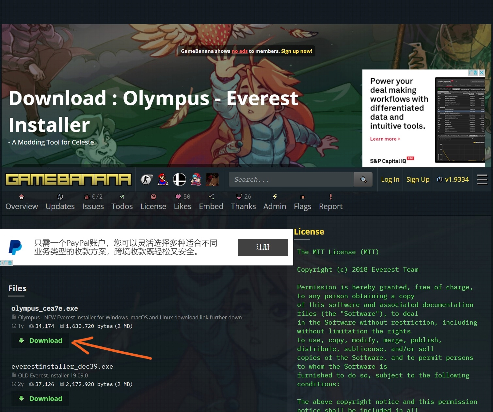
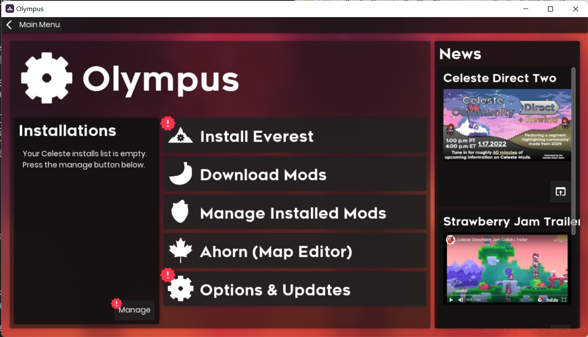
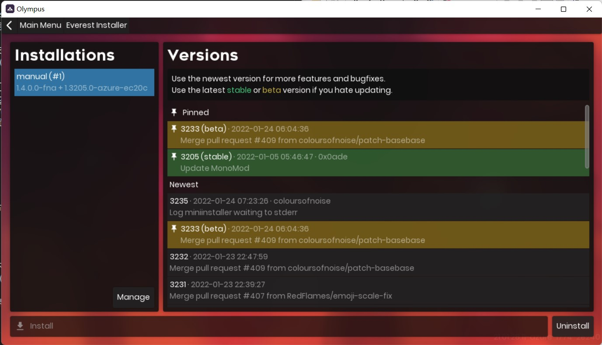

# Everest

**Everest** 是蔚蓝的 mod 加载器，是各种 mod 运行的必要组件，同时还具有 mod 升级、管理等功能。

## 安装 Everest

安装 Everest 的通用方法是访问其[官网](https://everestapi.github.io/)。如果你使用的是 **Windows 系统**，可以参考以下图文流程。

注意！以下安装说明仅适用于 Windows 系统。如果你使用的是 Mac 系统，请参照官网的说明。（欢迎使用 Mac 系统的大佬帮助完善此文档）

首先在[这里](https://gamebanana.com/tools/download/6449)（或使用[备用链接](https://github.com/EverestAPI/Olympus/releases)）下载 Everest 的安装器：**Olympus**。该页面上同时提供了旧版安装器（Everest Installer）的下载，但建议优先选择使用 Olympus。

下载完成后，可以在任意位置运行 Olympus，进行 Everest 的安装。注意安装时**不要运行游戏**。

运行后稍等片刻，第一次启动可能还会提示是否需要更新，更新与否均可。然后会看到如下界面：

首先点击左下方的 **Manage** 按钮，选择游戏的安装路径，如果没有自动检测到，请手动选择（选择 celeste.exe 所在的位置）。

然后返回主界面，点击第一行的 **Install Everest** 按钮，进入如下的安装界面：

在右侧选择想要安装的 Everest 版本，推荐选择最新的稳定版本（标有 stable 且背景为绿色），然后点击左下角的 **Install** 按钮，即可进行安装，等待安装完成即可。

除了安装、更新和卸载 Everest 以外，Olympus 还提供了 Mod 的安装与管理、Ahorn（蔚蓝的地图编辑器）的安装与管理等功能。但对于境内地区，由于网络因素，这些功能可能无法正常使用。所以在安装完 Everest 之后，Olympus 的任务就完成了，可以选择卸载掉，不会影响到已安装的 Everest 和 Mod。

一些常见问题：

- 如果安装时网络状况不好，则可能出现不能获取版本列表的情况，此时请手动下载安装包（可以从群文件找），然后在版本列表的最下方点击 **Select .zip from disk** 按钮，选择下载好的安装包进行安装。
- 如果显示异常，看不见某些按钮，则可能是由于 Windows 缩放导致的。请对桌面单击鼠标右键 -> 显示设置，把缩放暂时改回100%。

## 使用 Everest（Mod 的安装与管理）
