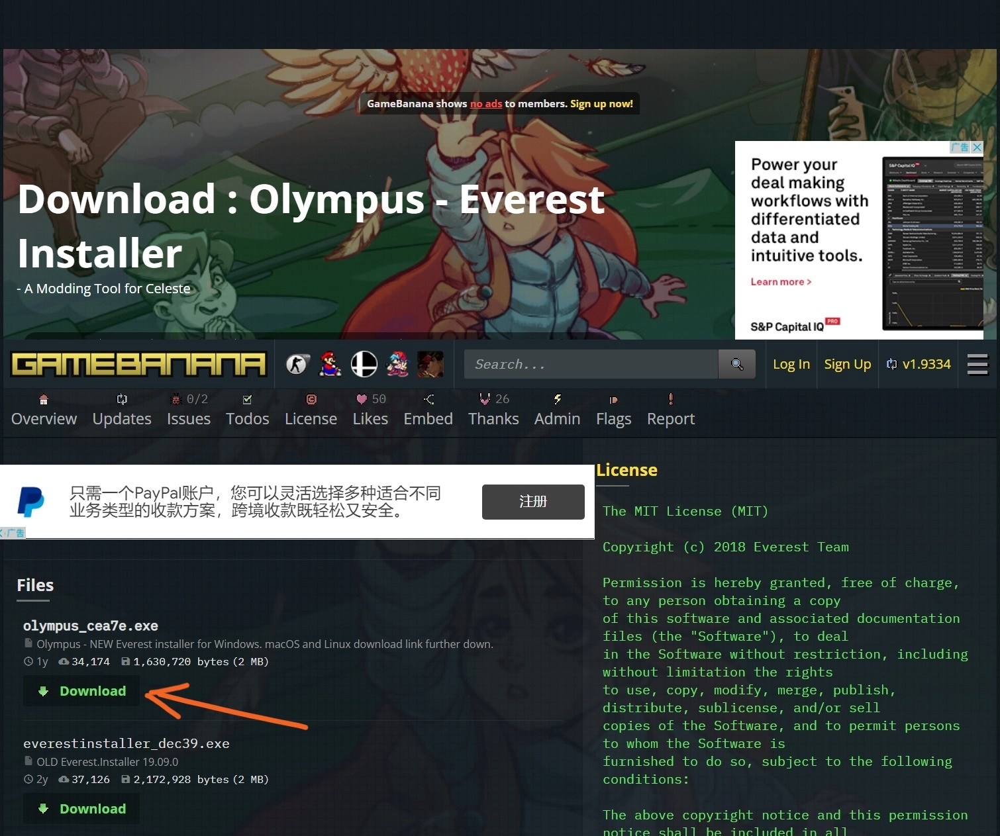
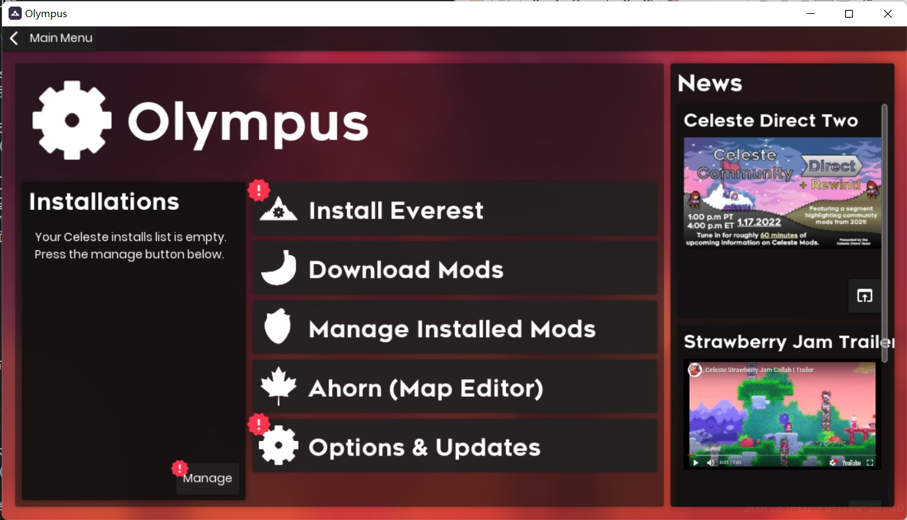
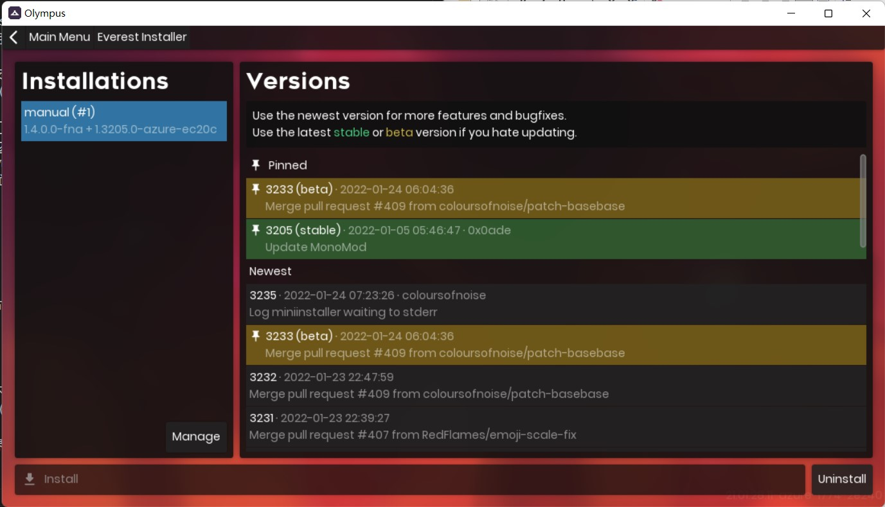
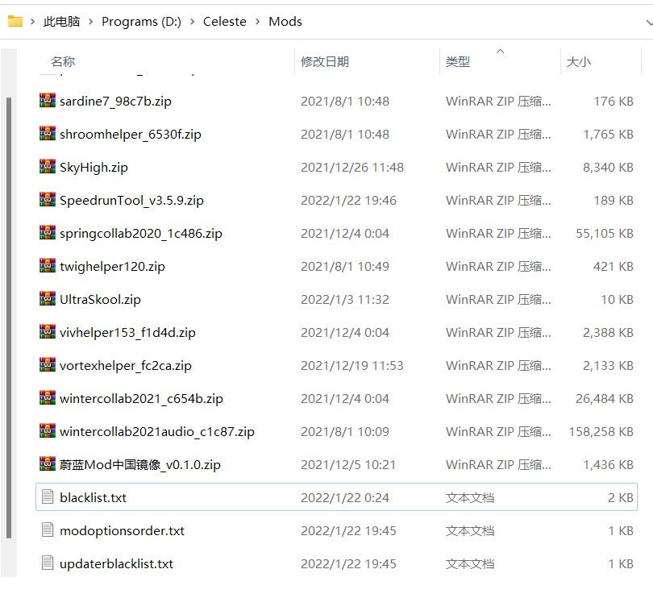
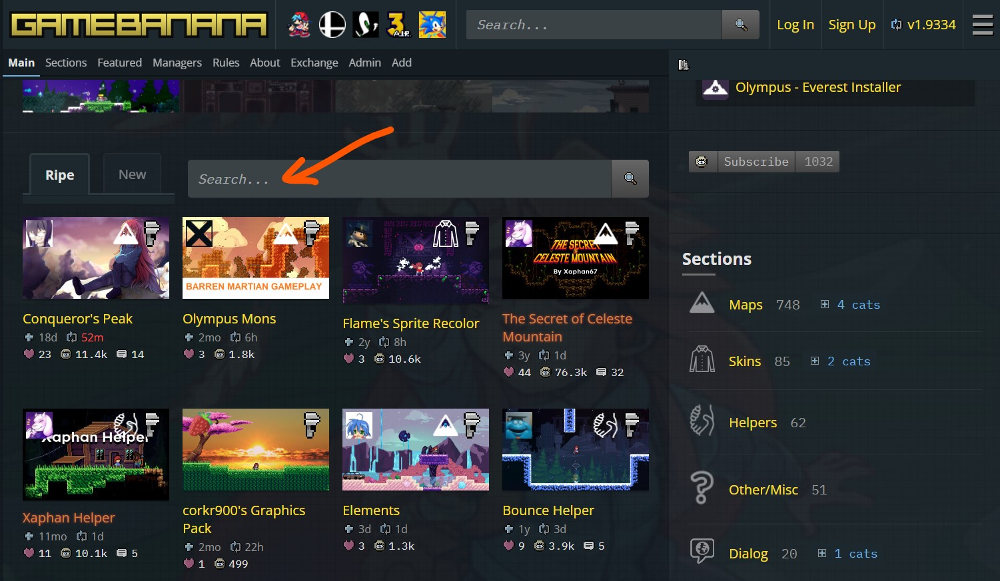
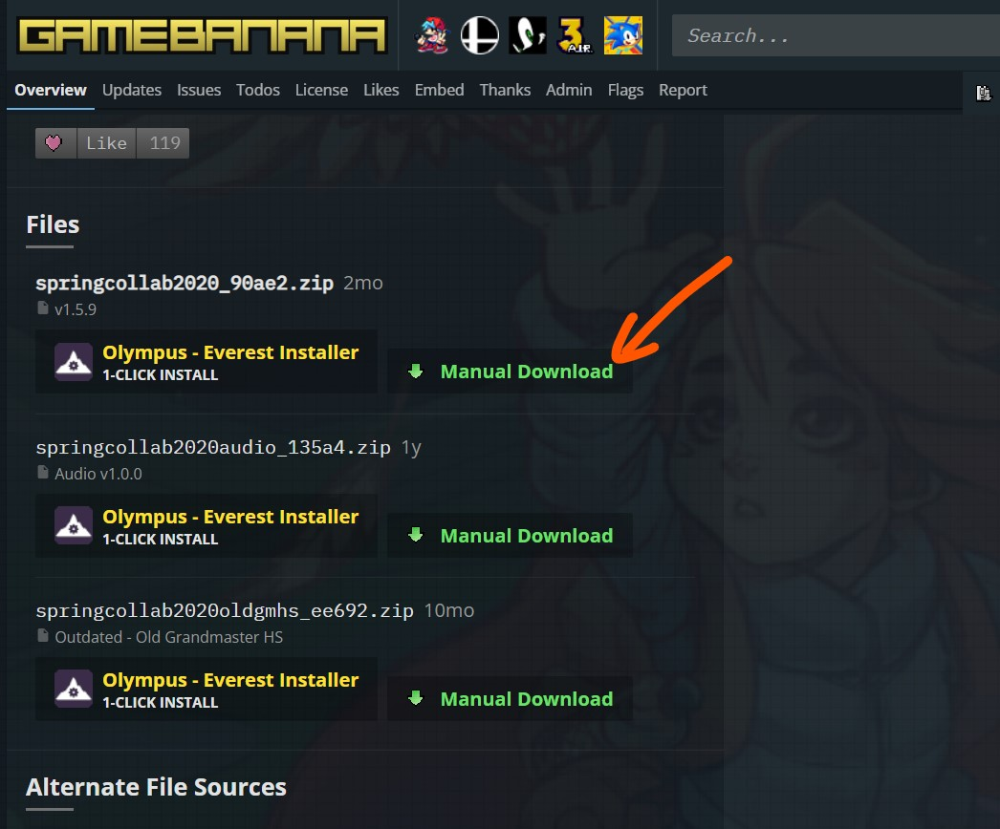
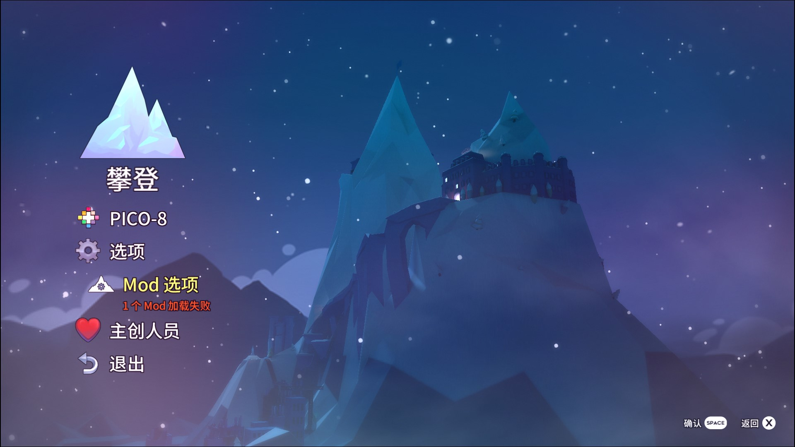
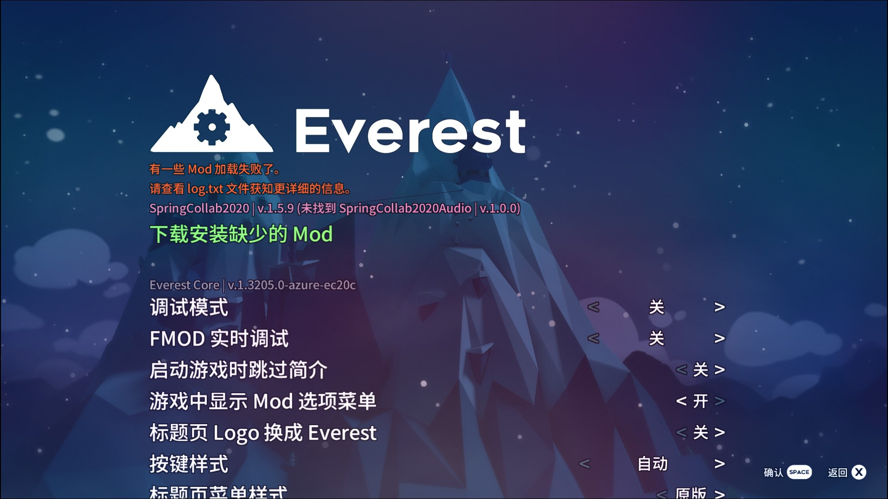

# Everest 与 Mod 的安装和管理

**Everest** 是蔚蓝的 mod 加载器，是各种 mod 运行的必要组件，同时还具有 mod 升级、管理等功能。

## 安装 Everest

安装 Everest 的通用方法是访问其[官网](https://everestapi.github.io)。如果你使用的是 **Windows 系统**，可以参考以下图文流程。

!> 以下安装说明仅适用于 Windows 系统。如果你使用的是 Mac 系统，请参照官网的说明。（欢迎使用 Mac 系统的大佬帮助完善此文档）

首先在[这里](https://gamebanana.com/tools/download/6449)（或使用[备用链接](https://github.com/EverestAPI/Olympus/releases)）下载 Everest 的安装器：**Olympus**。该页面上同时提供了旧版安装器（Everest Installer）的下载，但建议优先选择使用 Olympus。

下载完成后，可以在任意位置运行 Olympus，进行 Everest 的安装。注意安装时**不要运行游戏**。

运行后稍等片刻，第一次启动可能还会提示是否需要更新，更新与否均可。然后会看到如下界面：

首先点击左下方的 **Manage** 按钮，选择游戏的安装路径，如果没有自动检测到，请手动选择（选择 celeste.exe 所在的位置）。

然后返回主界面，点击第一行的 **Install Everest** 按钮，进入如下的安装界面：

在右侧选择想要安装的 Everest 版本，推荐选择最新的稳定版本（标有 stable 且背景为绿色），然后点击左下角的 **Install** 按钮进行安装，等待安装完成即可。

除了安装、更新和卸载 Everest 以外，Olympus 还提供了 mod 的安装与管理、Ahorn（蔚蓝的地图编辑器）的安装与管理等功能。但对于境内地区，由于网络因素，这些功能可能无法正常使用。所以在安装完 Everest 之后，Olympus 的任务就完成了，可以选择卸载掉，不会影响到已安装的 Everest 和 mod。

一些常见问题：

- 如果安装时网络状况不好，则可能出现不能获取版本列表的情况，此时请手动下载安装包（可以从群文件找，搜索 “Everest”，后缀是 .zip），然后在版本列表的最下方点击 **Select .zip from disk** 按钮，选择下载好的安装包进行安装。
- 如果显示异常，看不见某些按钮，则可能是由于 Windows 缩放导致的。请对桌面单击鼠标右键 -> 显示设置，把缩放暂时改回100%。

## Mod 的安装与管理

在安装好 Everest 后，游戏就具有了加载 mod 的功能。如果你想要启动不带 mod 的原版游戏，可以在游戏的**标题页面**（不是主菜单）按住右方向键，或者使用 Olympus 卸载 Everest。

安装和管理 mod 的方法有很多：

1. 在游戏目录下的 Mods 文件夹中手动管理
2. 使用 Olypmus 进行 mod 的安装、更新与卸载
3. 使用 Everest 进行 mod 的更新与禁用
4. 部分 mod 提供了有限的 mod 安装功能（如联机 mod）

如果你在境外地区，或者具备科学上网的能力，可以考虑使用 Olypmus（方法 2），这是最简便的方法。否则，请使用**方法 1**，这是最通用的方法。方法 3 和方法 4 可作为辅助（在境内需要安装中国镜像 mod 后才能使用）。

### 在 Mods 文件夹中手动管理 Mod

在游戏目录下的 **Mods 文件夹**中，可以手动管理 mod 的安装、更新、卸载与禁用。每个 mod 就是一个 **.zip 压缩文件**。

下载 mod 需要访问 [GameBanana](https://gamebanana.com/games/6460) 网站，在其中查找所需的 mod，可以在搜索框中输入名称进行查找。

在点开一个 mod 的页面后，可以在其中看到关于这个 mod 的各种信息，想要下载 mod 请往下拉页面，在 **Files** 部分点击第一个文件的 **Manual Download** 按钮进行下载（其余文件可稍后通过 Everest 自动下载，或者是非必需的）。

也可以从群文件或者其他途径下载 mod 的 .zip 压缩文件。

将下载好的 .zip 压缩文件移动到 Mods 文件夹中，**不要解压**，即可完成 mod 的安装。

!> 在群文件或其他地方下载的部分 .zip 压缩包属于 mod 整合包，在文件名上会有说明，这些整合包需要解压，解压后会得到很多个 .zip 文件，请注意区分

想要完全卸载 mod，可以直接删除对应的 .zip 文件，或者将其移出该文件夹。

Mods 文件夹中还有 3 个 .txt 文件，这些是 Everest 的一些配置文件，可以手动修改，请参考 **使用 Everest 管理 Mod** 部分。

### 使用 Olypmus 管理 Mod

如果你在境外地区，或者具备科学上网的能力，可以使用 Olympus 进行 mod 的安装、更新与卸载。只需在主界面点击 **Download Mods** 和 **Manage Installed Mods** 按钮即可，也可以在 GameBanana 的下载页面上点击 **Olympus - Everest Installer** 按钮。

### 使用 Everest 管理 Mod

!> 如果你在境内地区，请先使用方法 1 安装 [中国镜像](zh-cn/Celeste/Mods/Mod_usage.md) mod，否则无法正常使用 Everest 下载和更新 mod。

Everest 除了提供 mod 加载和使用的功能，还提供了在游戏内下载依赖文件、更新和禁用 mod 的功能。在主菜单或游戏暂停菜单中可以进入 **Mod 选项**。

在 Mod 选项页面，提供了非常多的 mod 管理功能。最上方是 Everest 的选项，后面依次列出了每个 mod 各自的选项。以下仅对 Everest 的部分选项进行说明。

如果部分 mod 缺少依赖文件，会加载失败，此时在选项的最上方会出现 **下载安装缺少的 Mod** 选项，可以直接下载安装。

Everest 默认会在启动时**自动更新**所有 mod，如果不希望自动更新，可以关闭该选项，并在 **检查更新 Mod** 中手动更新。

在 **启用或禁用 Mod** 选项中，可以手动选择启用或者禁用某个 mod，被禁用的 mod 不会在启动时加载，从而缩短游戏启动时间~~（优化做得不太好）~~。在其中显示为黄色的 mod 是被其他 mod 所依赖的 mod，如果直接禁用这些 mod 将会自动禁用部分其他 mod。显示为白色的 mod 可以安全地禁用。

已禁用的 mod 列表保存在 Mods 文件夹中的 **blacklist.txt** 文件中，可以手动修改，每行一个压缩包的名称。注意：在一行开头添加 # 号是注释，表示该行不会被识别，不会禁用该 mod，没有添加 # 号的才会被禁用。

如果希望检查更新时忽略某些 mod，可以在 **updaterblacklist.txt** 文件中添加。格式同上。

如果希望在 Mod 选项中调整各个 mod 选项的排序，可以在 **modoptionsorder.txt** 文件中添加。格式同上。

### 使用 Mod 安装 Mod

部分 mod 提供了有限的 mod 安装功能，请参考其各自的使用说明。

一个例子：使用联机 mod，传送到其他玩家时，如果没有安装该玩家正在玩的地图 mod，则会在联机 mod 的选项中添加一个 **Install recommended mods** 选项，可以直接安装该地图 mod。
