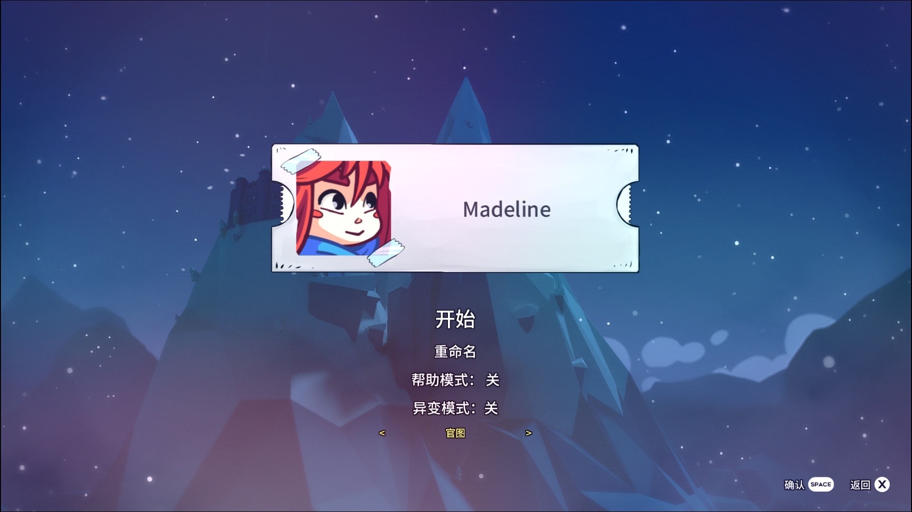
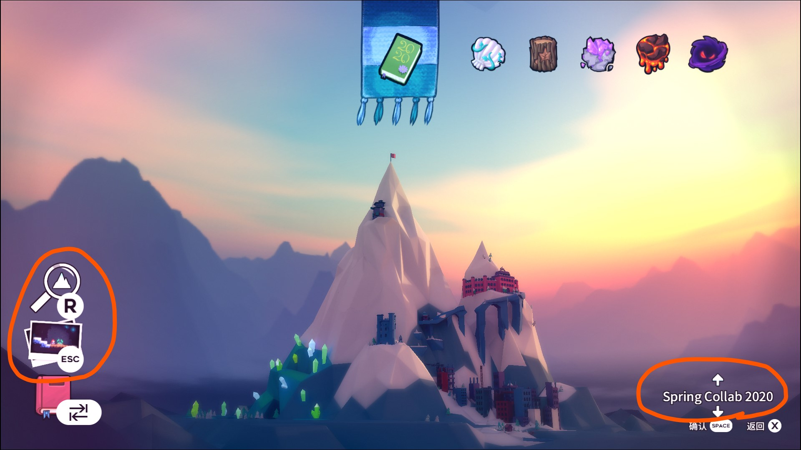

# Mod 使用说明

本部分介绍一些常用蔚蓝 mod 的使用方法。有关如何安装 mod，请参见 [Everest 与 Mod 的安装和管理](zh-cn/Celeste/Mods/Everest_and_mod.md)。

蔚蓝的 mod 大致可分为**功能性 mod** 和**地图 mod** 两类。这两类 mod 使用方法有很大区别，以下分别进行介绍。

## 功能性 Mod

功能性 mod 是为了拓展游戏原有的内容、添加一些新的功能和工具而设计的 mod。其中一部分成为了其他 mod 的依赖，而另一部分则需要单独下载。

这些 mod 的使用方法根据其功能不同而有所差异，但大多数都可从 **Mod 选项** 菜单中一探究竟。

!> 如果安装过多的功能性 mod，可能会显著延长游戏的启动时间，或者让游戏变得不稳定，甚至出现崩溃的情况

!> **辅助性的 mod 终究还是外物，提升自己的实力才是正确的选择** ——独步

### 联机 Mod

**联机 mod** 为游戏提供联机功能，可以与在线的其他小伙伴一同游戏。请参见 [群服](zh-cn/CelesteServer/README.md) 部分（尚未更新使用说明和下载链接，目前请在群文件内查找 **看这个** 和 **CelesteNet.Miao.Client.zip**。）。

### 中国镜像

!> 此 mod 不能从 GameBanana 上下载，[下载链接](https://celeste.weg.fan/files/ChinaMirror.zip)

**中国镜像**让境内玩家可以正常使用游戏内下载的功能，如 Everest 的下载依赖和更新、联机 mod 的下载等。境外玩家无需使用。

### 拓展异变 (Extended Variant Mode)

**拓展异变**是对游戏自带的**异变模式**功能的补充和扩展，提供了更多改变游戏画面、内容、玩法的选项，同时也是很多其他 mod 的依赖。

要使用拓展异变功能，需要先在 **Mod 选项**菜单中将其开关打开。使用时在**暂停菜单**中选择**拓展异变**可查看选项。

部分 mod 地图会使用到拓展异变的功能，在进入这些地图时会将拓展异变自动打开并重置。

### Speedrun Tool

!> 此 mod 会极大程度地影响游戏难度和游戏体验，新人在不具备相当的实力时不建议过度使用

**Speedrun Tool** 为游戏提供了**即时存档**（保存状态，即 SL）、**打开调试地图并传送**、**速通练习计时器**等辅助功能。由中国顶尖玩家 DemoJameson 开发~~（又名“大江之力”）~~。可在 **Mod 选项** 菜单中查看并设置各项功能的快捷键。

### DJ Map Helper

由 DemoJameson 开发的另一款 mod，主要是为地图创作者而设计，作为很多其他 mod 的依赖，但也为玩家提供了一个简单实用的功能：**一键望远镜**，可在 **Mod 选项** 菜单中查看并设置快捷键。

### CelesteTAS

用于编写 TAS (tool-assisted speedrun) 的 mod，对于玩家而言一个有用的功能是**开启碰撞箱显示**。有关 TAS 的更多信息请参见 [CelesteTAS](https://github.com/EverestAPI/CelesteTAS-EverestInterop/blob/master/README.md) 或查阅相关群文件。

### Celeste Randomizer

可以**生成随机地图**的 mod，在安装后可通过**主菜单**的选项进入。该 mod 将官图（和部分支持的 mod 地图）中每一个房间作为基本单位，通过随机拼接的方式组成新的地图。可以指定随机数种子，这样就可以和其他人游玩同一张随机地图。

### DeathTracker

在游戏内即时**显示死亡次数**的 mod，可以显示个人最佳纪录以及在超过该纪录时自动重开。

### Celeste Input History

在游戏内**显示按键输入历史**的 mod，可以用来诊断自己的操作问题。

### Stamina Meter

在游戏内**显示体力条**的 mod。

### 皮肤 Mod

（待更新）

## 地图 Mod

地图 mod 为游戏提供了可游玩的玩家自制地图，安装 mod 后可在游戏内直接选择相应地图进入，一般不会在 **Mod 选项** 菜单中提供额外选项。

进入这些 mod 地图的方法有两种：

在**创建新存档**的时候，可以在最下方看到一个地图集的选项，按左右方向键可选择不同的地图 mod 开始游玩，会自动进入其序章（如果没有序章则进入第一章）。无论此处选择了哪个地图 mod，在游戏内都可以通过下面另一种方法进入其他地图 mod。

在游戏的**地图界面**，可以按上下方向键选择不同的地图 mod，还可以按 Esc 快速筛选子图，或者按 R 进行搜索。

有关地图 mod 的列表，请参见 [玩家自制图](zh-cn/Celeste/Maps/) 部分（此部分待更新）。
