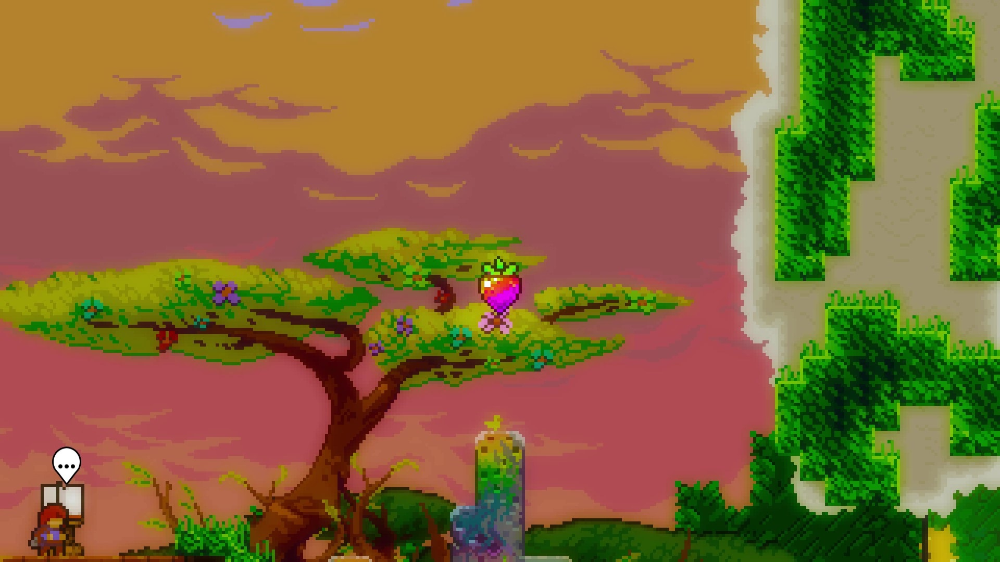

# Mod 使用说明

本部分介绍一些常用蔚蓝 mod 的使用方法。有关如何安装 mod，请参见 [Everest 与 Mod 的安装和管理](zh-cn/Celeste/Mods/Everest_and_mod.md)。

蔚蓝的 mod 大致可分为**功能性 mod** 和**地图 mod** 两类。这两类 mod 使用方法有很大区别，以下分别进行介绍。

## 功能性 Mod

功能性 mod 是为了拓展游戏原有的内容、添加一些新的功能和工具而设计的 mod。其中一部分成为了其他 mod 的依赖，而另一部分则需要单独下载。

这些 mod 的使用方法根据其功能不同而有所差异，但大多数都可从 **Mod 选项** 菜单中一探究竟。

本部分介绍一些常用功能性 mod 的使用方法，想要查找 mod 请参见 [功能性 Mod 列表](zh-cn/Celeste/Mods/Functional_mod_list.md)。

!> 如果安装过多的功能性 mod，可能会显著延长游戏的启动时间，或者让游戏变得不稳定，甚至出现崩溃的情况

!> **辅助性的 mod 终究还是外物，提升自己的实力才是正确的选择** ——独步

### 联机 Mod

**联机 mod** 为游戏提供联机功能，可以与在线的其他小伙伴一同游戏。请参见 [群服](zh-cn/CelesteServer/README.md) 部分（尚未更新使用说明和下载链接，目前请查看 **群公告**）。

### 中国镜像

!> 此 mod 不能从 GameBanana 上下载，[下载链接](https://celeste.weg.fan/files/ChinaMirror.zip)

**中国镜像**让境内玩家可以正常使用游戏内下载的功能，如 Everest 的下载依赖和更新、联机 mod 的下载地图等。境外玩家无需使用。

### 拓展异变 (Extended Variant Mode)

**拓展异变**是对游戏自带的**异变模式**功能的补充和扩展，提供了更多改变游戏画面、内容、玩法的选项，同时也是很多其他 mod 的依赖。

要使用拓展异变功能，需要先在 **Mod 选项**菜单中将其开关打开。使用时在**暂停菜单**中选择**拓展异变**可查看选项。

部分 mod 地图会使用到拓展异变的功能，在进入这些地图时会将拓展异变自动打开并重置。

### 速通辅助工具 (Speedrun Tool)

!> 此 mod 会极大程度地影响游戏难度和游戏体验，新人在不具备相当的实力时不建议过度使用

**Speedrun Tool** 为游戏提供了**保存状态**（实时存档和读档，即 SL）、**打开调试地图并传送**、**速通练习计时器**等辅助功能。由中国顶尖玩家 DemoJameson 开发~~（又名“大江之力”）~~。可在 **Mod 选项** 菜单中查看并设置各项功能的快捷键。

### CelesteTAS

用于编写 TAS (tool-assisted speedrun) 的 mod，对于玩家而言一个有用的功能是**显示碰撞箱和数值面板**。有关 TAS 的更多信息请参见 [CelesteTAS](https://github.com/EverestAPI/CelesteTAS-EverestInterop/blob/master/README.md) 或查阅相关群文件。

### Celeste Randomizer

可以**生成随机地图**的 mod，在安装后可通过**主菜单**的选项进入。该 mod 将官图（和部分支持的 mod 地图）中每一个房间作为基本单位，通过随机拼接的方式组成新的地图。可以指定随机数种子，从而多次游玩同一张地图。如果想要在联机 mod 中和其他人游玩同一张随机地图，需要将所有设置调成一致，并输入相同的随机数种子。

## 皮肤 Mod

（欢迎熟悉皮肤 mod 的大佬帮助更新此部分）

## 地图 Mod

地图 mod 为游戏提供了可游玩的玩家自制地图，安装 mod 后可在游戏内直接选择相应地图进入，一般不会在 **Mod 选项** 菜单中提供额外选项。

进入这些 mod 地图的方法有两种：

在**创建新存档**的时候，可以在最下方看到一个地图集的选项，按左右方向键可选择不同的地图 mod 开始游玩，会自动进入其序章（如果没有序章则进入第一章）。无论此处选择了哪个地图 mod，在游戏内都可以通过下面另一种方法进入其他地图 mod。

在游戏的**地图界面**，可以按上下方向键选择不同的地图 mod，还可以按 Esc 快速筛选子图，或者按 R 进行搜索。

以下部分介绍地图 mod 的一些通用机制。有关地图 mod 的列表，请参见 [玩家自制图](zh-cn/Celeste/Maps/) 部分。

### 地图合集

部分地图 mod 属于**地图合集**，在一个章节中包含一个**大厅**和很多**小型地图**。这类 mod 的名称中一般会包含 **collab**、**contest** 或 **collection**。

对于地图合集，在地图界面选择一个章节可以进入这一章的**大厅**。在大厅中可以查看**小型地图**的信息并进入该地图，也可以查看每个小型地图的**日志**（在地图界面的日志只能看到整个章节的汇总信息）。

在游玩小型地图时，暂停菜单的最下方会增加一个**返回大厅**选项，可以利用这个选项返回大厅并保存这个小型地图的进度。每个小型地图的进度相互独立，可以同时保存多个进度。读取进度时需要在大厅中该小型地图的信息界面选择**继续**。而非合集类地图只能通过**保存并退出**来保存进度，一个存档只能保存一个进度。

每个小型地图通关时会收集到这个地图的**小型水晶之心**（与官图的 B 面和 C 面类似）。在每个章节的大厅中有一个**心门 (heart door)**（与官图第 8 章和第 9 章的心门类似），通关所有小型地图，收集全部小型水晶之心即可将其打开，解锁最终关卡（**heart side**，一般也将这个关卡称为**心门**）。在心门关卡通关时会收集到这个章节的**水晶之心**。

### 特殊草莓

在部分地图 mod 中会出现官图没有的草莓类型，其中常见的有：**银草莓**、**速通草莓**、**彩虹草莓**。

**银草莓**和**速通草莓**与官图中的金草莓类似，在通关后会出现在关卡起点处，需要携带至终点才能收集。**银草莓**与金草莓的效果完全一致，需要**一命通关**才能获得，一旦死亡就会回到起点，一般出现在合集图的每张小型地图中。**速通草莓**在携带后会显示金、银、铜三个等级的速通时限，在相应的时限内通关即可收集到该等级的速通草莓，**不要求一命通关**，但是在超出了铜等级的时限后会爆炸，回到起点。银草莓计入草莓的总数，速通草莓不计入草莓的总数。

**彩虹草莓**是一种特殊的草莓，一般只会出现在合集图中。在合集图的一章中，收集每张小型地图的**银草莓**即可在大厅中解锁彩虹草莓，作为完美通关的奖励。彩虹草莓收集时会有特殊的声音和特效。彩虹草莓计入草莓的总数。

