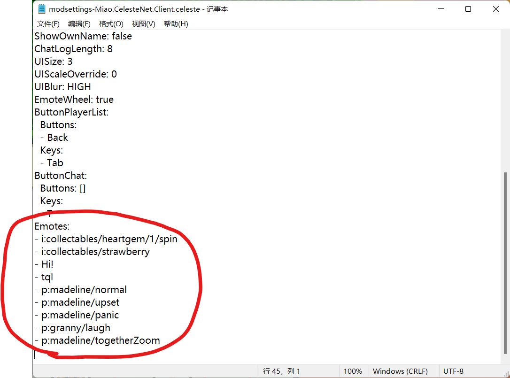

# 进阶使用说明

此部分对联机 mod 的功能进行详细说明。

由于群服 mod 是基于 [CelesteNet](https://gamebanana.com/mods/53695) 修改的，所以此部分内容同样适用于 CelesteNet。

## 设置菜单

在主菜单和游戏内暂停菜单的 **Mod 选项**中均可找到群服的设置菜单。但由于暂停菜单内不能输入文字，故不能在游戏内修改用户名和密码。

可以在 **Mod 选项**中将群服的相关设置置顶，请参见[使用 Everest 管理 Mod](zh-cn/Celeste/Mods/Everest_and_mod.md?id=使用-everest-管理-mod)。

所有的设置内容都保存在**设置文件**中（Saves\modsettings-Miao.CelesteNet.Client），可以在关闭游戏后手动修改，或查看保存的用户名和密码。

- **Connected**：群服连接
- **Auto Reconnect**：自动重连，如果遇到群服断连时游戏卡死的情况，可以尝试关闭此选项
- **Server**：服务器选择，目前有主服务器（SmallMiao）和备用服务器（WEGFan）
- **Interactions**：互动功能
- **Sounds**：其他玩家所发出的声音，用 **Sound Volume** 调整音量大小
- **Entities**：其他玩家身边的实体（草莓、钥匙、水母等）
- **Player List Mode**：玩家列表模式，建议使用 Channels
- **Show Player List Locations**：在玩家列表中显示玩家的位置
- **Show New Messages**：有新消息时在左下角显示提示
- **Player Opacity**、**Name Opacity**：其他玩家和头顶名称的不透明度
- **Show Own Name**：显示自己的名称
- **UI Size**：玩家列表和聊天内容的大小
- **UI Blur**：玩家列表和聊天框背景的模糊效果
- **Emote Wheel**：表情轮盘（仅限手柄）
- **Reload Emotes**：重新加载自定义表情（请参见下方**自定义表情**）

## 命令列表

按下 `T` 键（支持改键）可以打开聊天框，在其中输入以 `/` 开头的命令后按下 `Enter` 即可执行命令，这些命令不会被其他玩家看到。

- `/help`：显示命令列表**帮助**。后接数字可翻页，如 `/help 2` 查看第二页命令。后接命令名可查看命令的详细说明，如 `/help emote` 查看 `/emote` 命令的详细说明。
- `/tp`：**传送**到指定玩家的身边。后接玩家名称，如 `/tp Miao` 传送到 Miao 的身边。玩家名称可以不输全，只需输入前几个字母即可。如果没有安装该玩家正在游玩的地图，则传送会失败，并在 **Mod 选项**中添加一个 **Install recommended mods** 选项，可以用此选项安装该地图 mod。
- `/back`：**返回**上次使用 `/tp` 传送之前的位置。
- `/tpon`、`/tpoff`：**允许**或**禁止**其他玩家传送到自己身边。
- `/e`、`/emote`：发送**自定义表情**，请参见下方说明。
- `/w`、`/whisper`：发送**悄悄话**。后接玩家名称和消息内容，如 `/w Miao tql` 发送悄悄话“tql”给 Miao。玩家名称可以不输全，只需输入前几个字母即可。
- `/join`、`/channel`：加入**聊天频道**。后接频道名称，如 `/join sanbu` 加入频道“sanbu”。如果频道不存在将会自动创建。输入以 `!` 开头的频道名称会创建或加入私密频道，不会显示在玩家列表中。公共频道的名称是 `main`。
- `/cc`、`/channelchat`：发送**频道聊天消息**。后接消息内容。只有处于该频道内的玩家才可看见。
- `/gc`、`/globalchat`：发送**公共聊天消息**。后接消息内容。所有玩家都可看见。

## 自定义表情

联机 mod 支持发送自定义表情，允许的范围包括 **Gameplay**、**Gui** 和 **Portraits** 三个文件夹下的图片。游戏本体的图片文件是经过打包的，要查看这些文件请自行**解包**或直接查找**群文件**中的 **Celeste Graphics Dump**。也可直接发送任意文字作为表情。

### 自定义表情格式

要发送图片作为自定义表情，请首先找到 **Gameplay**、**Gui** 和 **Portraits** 这三个文件夹，然后在其中找到所需的**图片文件**。根据文件路径和名称（不包括文件名后缀）来确定表情格式。

- **Gameplay** 下的文件以 `g:` 开头，如钥匙的图片位于 Gameplay\collectables\key\idle，则其表情格式为 `g:collectables/key/idle`。
- **Gui** 下的文件以 `i:` 开头，如菜单中金草莓的图片位于 Gui\collectables\goldberry，则其表情格式为 `i:collectables/goldberry`。
- **Portraits** 下的文件以 `p:` 开头，如奶奶大笑的图片位于 Portraits\granny\laugh，则其表情格式为 `p:granny/laugh`。

如果想要发送**动态表情**，有两种实现方式：

- 如果想要发送的表情图片文件具有一系列相同的名称，如奶奶大笑的文件名分别是 laugh00、laugh01、laugh02、laugh03，则可以省略后方的数字，直接使用`p:granny/laugh`（以上钥匙的示例也是同理），将会循环播放这一系列图片。（注意：系列文件名的数字必须以 00 开头，例如 `g:collectables/strawberry/wow/normal` 是无效的）
- 如果想要发送特定的多张图片，或者不希望循环播放，则可以手动指定多个文件名，例如 `p:granny/laugh00 granny/laugh01 granny/laugh02 granny/laugh03`。在播放到最后一张图片时将会定格。

动态表情支持**自定义帧率**，可在 `:` 后添加数字来指定帧率，如 `p:30 granny/laugh` 将以每秒 30 帧的速度播放奶奶大笑的表情。默认是每秒 7 帧。

### 自定义表情发送方式

确定了以上的表情格式后，可以在游戏内通过两种方式发送表情，分别是**聊天框**和**快捷表情**。

在**聊天框**中使用 `/e` 或 `/emote` 命令即可发送表情。如 `/e p:granny/laugh` 发送奶奶大笑的表情，`/e tql` 发送“tql”文字表情。

在群服 mod 的**设置文件**（Saves\modsettings-Miao.CelesteNet.Client）的末尾可以找到**快捷表情**的设置，每行以 `-` 开头并接一个空格，然后接一个表情格式，如 `- p:granny/laugh` 代表奶奶大笑的表情。这些快捷表情从上至下分别使用键盘上的**数字键 1~0** 或手柄的**右摇杆**来发送，最多设置 10 个，不支持改键。

可以在游戏运行时直接修改快捷表情，保存文件后使用 **Mod 选项**中的 **Reload Emotes** 即可**重载快捷表情**，以用于测试。（在游戏运行时对文件中其他选项进行的修改无效）
