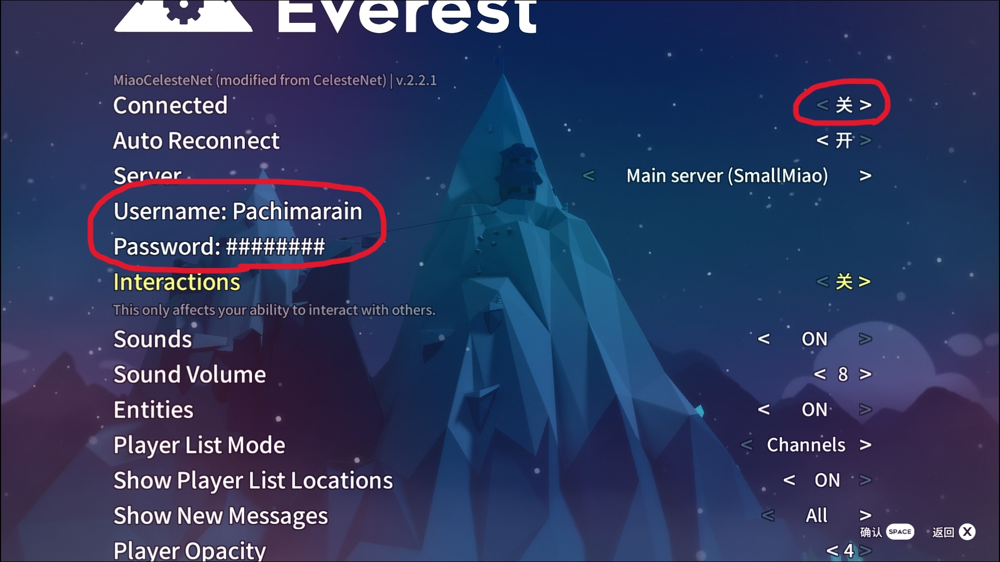
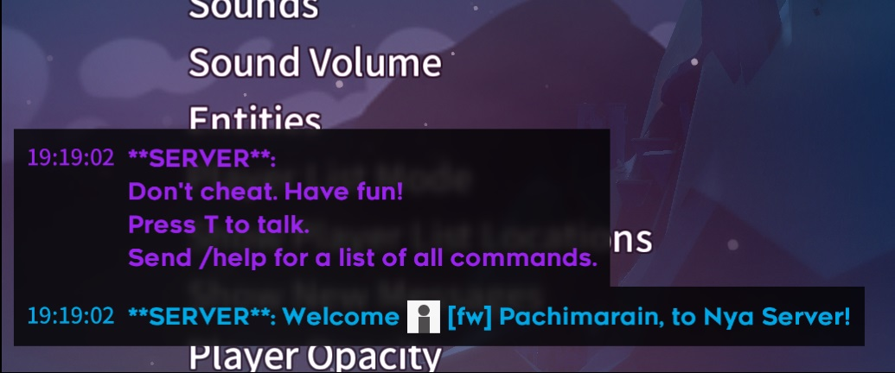

# 基本使用说明

如果你是第一次使用联机 mod，请阅读本说明。如果想要查找更详细的使用说明，请参见[进阶使用说明](zh-cn/CelesteServer/Advanced_usage.md)。

## 下载和安装

群服 mod 的下载请在**群文件**中查找“群服 mod”。有关 mod 的安装请参见[Mod 的安装与管理](zh-cn/Celeste/Mods/Everest_and_mod.md?id=mod-的安装与管理)。

## 游戏内登录

要登录群服账号，请在 **Mod 选项**菜单中找到 **MiaoCelesteNet** 部分，在 **Username** 和 **Password** 中输入账号和密码，然后将 **Connected** 设置为“开”以进行连接。

连接成功时，左下角会显示一条欢迎登录的提示信息。

如果连接不成功，请先尝试几次。或根据提示信息排查问题，如用户名或密码错误、网络连接异常等。如果在尝试连接的瞬间显示连接失败（Connection failed），请先检查自己的网络，若确认没有问题则很可能是服务器出现了故障，此时可在 **Server** 选项中切换到备用服务器进行连接。

## 基本功能介绍

在群服连接成功后，就可以使用联机 mod 所提供的各项功能。以下对一些基本功能进行简要介绍，更详细的介绍请参见[进阶使用说明](zh-cn/CelesteServer/Advanced_usage.md)。

按下 `TAB` 键可在左上角打开**玩家列表**，查看当前在线的玩家以及他们各自所在的地图位置。

按下 `T` 键可在左下角打开**聊天框**，在其中输入聊天内容后按下 `Enter` 键可发送信息，当前在线的所有玩家都可看到。

在聊天框中输入 `/tp` 可以**传送**到指定玩家的身边，如输入 `/tp Miao` 可传送到 Miao 的身边。有关更多命令请查看[命令列表](zh-cn/CelesteServer/Advanced_usage.md?id=命令列表)或在聊天框中输入 `/help` 查看帮助。

在游戏内按下数字键（非小键盘）可**发送表情**，手柄使用右摇杆可打开**表情轮盘**选择表情，按下右摇杆发送。还可以[自定义表情](zh-cn/CelesteServer/Advanced_usage.md?id=自定义表情)。

在游戏内可以与其他玩家进行**互动**，可以按抓键将别人举起并扔出去，也可以踩在别人的头上跳跃。互动功能的开关是 **Mod 选项**中的 **Interactions**，只有当双方玩家都打开了此功能时才可进行互动。
