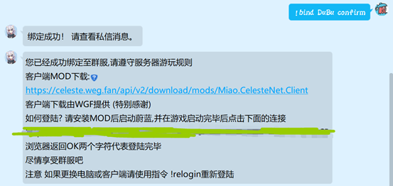

# 联机mod的使用

确认你的mods文件夹里没有celestenet，ghostnet这样的文件，
旧群服已停止运行，请删除celestenet，ghostnet，Miao.CelesteNet.SpeedrunLeaderboard和MiaoCelesteNet.Client2.1.0

确认自己的 celeste 和 everest 均是最新版本（stable），然后在群文件内找到群服MOD文件夹，
下载MiaoCeleste Net.

如果之前安装过群服的旧版本，或者国外服，或者鬼服之类，需要将这些文件全部删除

首先加群服账号注册群565265554，添加机器人好友（可以不加），然后在在注册群里发!bind DuBu（dubu是一个例子，感叹号是英文，注意bind和用户名中间有一个空格。用户名就是你在群服里显示的名字），然后机器人会给你私信

我们直接负责粘贴 !bind DuBu confirm 发送给机器人确认即可（如果不满意，在群里重复上一步）如果没有弹出，私聊机器人 !relogin（同理，英文感叹号，私聊没反应在群里发一次）

打开游戏！打开游戏！打开游戏！

确认打开游戏之后，点击下面的确认链接，左上角有个ok
 
然后，进入mod选项，直接点击链接，不要更改用户名（上面的链接是下载群服文件的，下面的才是确认链接）

注意事项：
1. 请各位的用户名认真合规，请勿起违规游戏名称，游玩过程中请和谐友爱，禁止游戏内发送违规词语等行为，一旦发现直接永久封禁
**2. 一旦退出群服注册群，账号将会自动注销，群服账号是绑定你的QQ账号的**

感谢小喵和伟哥基
